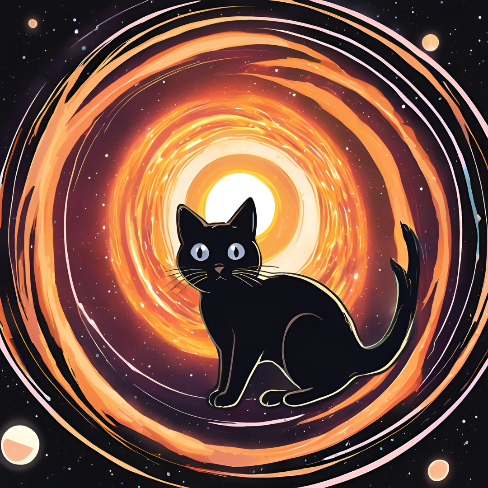

# TDECat

#-----------------------------------------------------------------------------------------------------------------------#

This is a supplementary repository for the Tidal Disruption Event (TDE) catalogue (TDECat hereafter) presented in Langis et al. 2025 (in review).
We have collected publicly available multi-wavelength photometry and optical spectroscopy.
TDECat can either be accessed by the different sections (read below for more details) or by the app (App section).
Below we outline the structure of this repository, as well as a give quick overview of each section.

#-----------------------------------------------------------------------------------------------------------------------#

## Section 1: Main TDE Catalogue

In this section we present the TDECat sources, along with their coordinates and other information through the TDE_catalogue_all.csv file.

#-----------------------------------------------------------------------------------------------------------------------#

## Section 2: Photometry

This section is split into 3 subsections: Optical and Infrared, UVOT and X-ray. 
i) In the Optical and Infrared subsection we include all the publicly available photometry, collected mainly using the Black Hole Target Observation Manager (BHTom; https://bh-tom2.astrolabs.pl). 
ii) In the UVOT subsection we present the data collected through the Swift Ultraviolet and Optical Telescope (UVOT; Roming et al. 2005).
iii) In the X-ray subsection we present the available data for our main catalogue sample in the archives of Swift, Chandra and XMM-Newton missions. In addition, we looked for X-ray counterparts to TDE sources in the 13th data release of the fourth XMM-Newton serendipitous source catalogue (4XMM-DR13, Webb et al. 2020) and eROSITA main catalogue (eRASS1, Merloni et al. 2024). More information about the data reduction process can be found in Appendix B of Langis et al. 2025.

For more details, please read Sect. 3 of Langis et al. 2025.

#-----------------------------------------------------------------------------------------------------------------------#

## Section 3: Spectroscopy

The optical spectra in this section were all taken from either the Transient Name Server (TNS; https://www.wis-tns.org/) or from the Weizmann Interactive Supernova Data Repository (WISeREP; https://www.wiserep.org/; Yaron & Gal-Yam 2012). For some TDEs, the spectra are available in past studies that are referenced in Sect. 3.4 of Langis et al. 2025. In this section we also include a .csv file (spectral_classes.csv), where we outline all the different TDE spectral classification of each object, as well as their corresponding reference.

#-----------------------------------------------------------------------------------------------------------------------#

## Section 4: App

We present a python app that runs locally, displaying the information included in TDE_catalogue_all.csv. It also plots the different waveband light curves and spectra for the TDEs in the sample. For more information on how to operate it, select the App section and read README_APP.txt.

#-----------------------------------------------------------------------------------------------------------------------#

## Section 5: Honorable Mentions

In this section we present TDE candidates that have strong indications of being TDEs; however, either another event class (e.g. AGN, SN) cannot be excluded or there are no available spectra from the time of the flare. These sources are included in a pdf file named Honourable_Mentsions_Table.pdf.

#-----------------------------------------------------------------------------------------------------------------------#

## Acknowledging TDECat

To acknowledge TDECat, please cite Langis et al. 2025 in your work. 

<a href="https://creativecommons.org">TDECat</a> © 2025 by <a href="https://creativecommons.org">Dimitrios Alkinoos Langis</a> is licensed under <a href="https://creativecommons.org/licenses/by-nc/4.0/">Creative Commons Attribution-NonCommercial 4.0 International</a>
